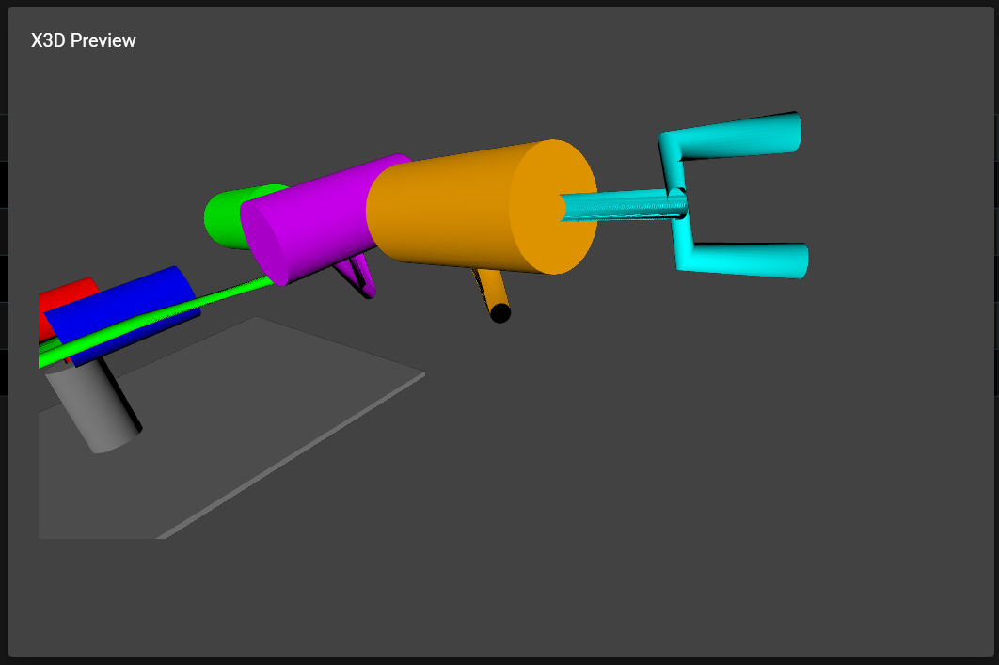
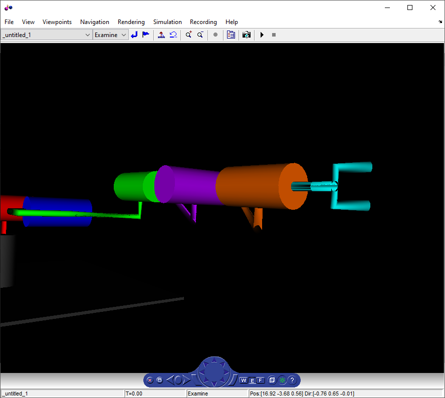

# Real-time Robot Rendering with Simulink

## Quick Start

- Navigate to https://gigahawk.github.io/dh2vrml_flutter/ and wait for the application to load
- Click the `Import Parameters` button and select the provided `sample_puma_not_to_scale.py`
- Preview the generated model with the `Preview X3D` button
- Export the generated model with the `Export X3D` button
    - Enable `Generate Simulink Model` first to generate a Simulink model with a VR Sink block already configured with the correct parameters exposed.

## `dh2vrml`

`dh2vrml` is a Python library and CLI tool that takes a table of Denavit-Hartenberg parameters and generate an X3D model file suitable for use in a Simulink VR Sink block.

> In early development the output format was VRML hence the name, however later X3D was used to take advantage of the Python `x3d` package

`dh2vrml` is hosted on PyPi at https://pypi.org/project/dh2vrml/.

The source code for the project is hosted on GitHub at https://github.com/Gigahawk/dh2vrml

The `README` provides basic usage instructions.
Run `dh2vrml --help` to show all options provided by the CLI tool.

## `dh2vrml_flutter`

`dh2vrml_flutter` is a web app built with Flutter to make it easy to use `dh2vrml` without installing anything.

`dh2vrml_flutter` is hosted on GitHub Pages at https://gigahawk.github.io/dh2vrml_flutter/.

The source code for the project is hosted on GitHub at https://github.com/Gigahawk/dh2vrml_flutter

### Notes

- At the moment errors are not communicated to the user, actions may fail silently. Errors are logged to the browser console (press F12).
- At the moment not all features supported in `dh2vrml` are exposed
- To avoid hosting costs, all computation happens locally within your browser, there is no server-side processing of any kind. GitHub Pages just hosts static files
    - Loading the application is slow because your browser downloads and installs the Python environment required to run `dh2vrml` every time the page is refreshed.

### Usage

- `Set Name`: Set the name for the exported files (`robot` is used as a default if none is provided)
- `Import Parameters`: Import an existing DH-parameter file from your computer, click `Help` for details about supported file types and available parameters
- `Save CSV`: Export the currently loaded parameters as a CSV file
- `Preview X3D`: Preview the generated robot model
- `Export X3D`: Save the generated robot model file
- `Angle Unit`: Select angle units shown in the table
- `Generate Simulink Model`: Generate a Simulink model when exporting the X3D file
    - The provided file should be compatible with any Simulink/MATLAB version containing support for VR Sink blocks
    - Simulink model will contain:
        - A VR Sink Block already configured to use the X3D file
        - A single constant [0 0 1]^T block
        - A mux block (for rotations)
    - Files will be bundled together as a `.zip` file
    - `.rotation` inputs expect a 4 element vector where:
        - The first 3 elements form the rotation axis (should always be [0 0 1]^T)
        - The last element is the angle
    - `.translation` inputs expect a 3 element translation vector (should always be a multiple of [0 0 1]^T)

## Future Improvements

### Link Rendering

Links are rendered using [X3D Extrusions](https://doc.x3dom.org/author/Geometry3DExt/Extrusion.html), which sometimes causes weird visual artifacting in both the web app preview and Simulink:

There may be solutions to this, otherwise it may be preferable to approximate extrusions with cylinders

### Link Path Calculation

As shown in the sample, the algorithm that calculates the path between joints is rather simple, and can produce links that intersect with joints.

General collision detection (and correction) along the link path would be quite complicated to implement, especially since joints themselves are allowed to intersect, however there are definitely improvements that can be made to the existing algorithm.

